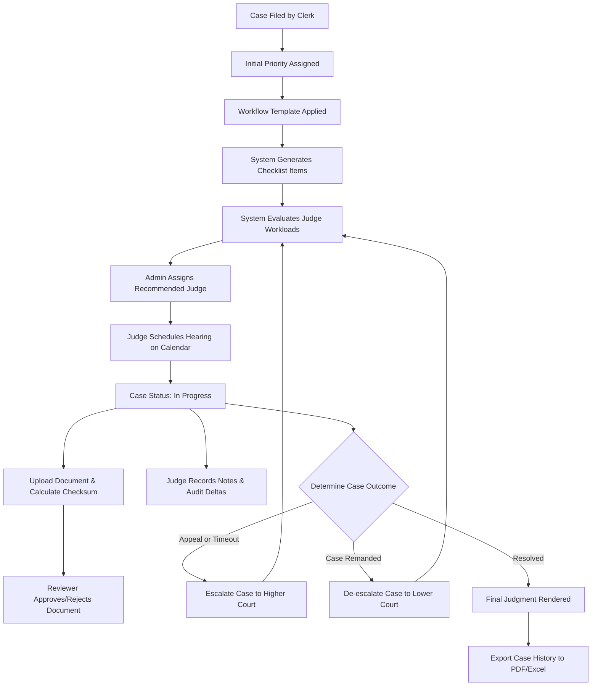

# Differentiated Case Flow Management System (DCM)

## Project Overview
The Differentiated Case Flow Management (DCM) System is an enterprise-grade platform designed to track, schedule, and manage judicial cases across a three-tier court hierarchy comprising District, High, and Supreme Courts. The platform provides automated case number generation, rule-based court escalation, dynamic case priority calculation, structured checklist-driven workflows, multi-version document management, and live activity auditing. It is designed to assist judicial administrators, judges, clerks, and advocates in optimizing case lifecycles and reducing overall judicial delays.

## Technology Stack

### Backend Architecture
*   **Framework**: Spring Boot 3.2.0
*   **Language**: Java 17
*   **Database Management**: Spring Data JPA with Hibernate ORM
*   **Data Persistence**: H2 (In-Memory Database for local development/testing) / MySQL 8.0 and PostgreSQL 12+ (Production-ready)
*   **Caching Layer**: Spring Cache abstraction with Redis integration
*   **Security & Authentication**: Spring Security with stateless JSON Web Tokens (JWT) and BCrypt password encryption
*   **Rate Limiting**: Bucket4j token bucket algorithm enforced via Servlet Filter
*   **Real-time Communication**: Spring WebSocket messaging using SockJS fallback and STOMP protocol
*   **API Documentation**: Springdoc OpenAPI / Swagger UI
*   **Reporting Engines**: iText (PDF generation with lifecycle progress visual bars) and Apache POI (Excel spreadsheet compilation)
*   **Build Tool**: Maven 3.6+

### Frontend Architecture
*   **Library**: React 19
*   **Routing**: React Router DOM 6
*   **State Management**: React Context API (AuthContext, ThemeContext)
*   **User Interface Components**: Material UI (MUI) Icon libraries
*   **Styling Engine**: Tailwind CSS 3.x / PostCSS
*   **Data Visualization**: Chart.js with React Chartjs 2 wrapper
*   **Scheduling Calendar**: FullCalendar React wrapper
*   **HTTP Client**: Axios
*   **WebSocket Client**: SockJS-client and @stomp/stompjs

---

## Core System Architecture & Packages

### Backend Directory Structure
```
backend/src/main/java/com/example/dcm/
├── config/             # Configuration beans (WebSockets, Security, Cache, OpenAPI)
├── controller/         # REST API Controllers (Auth, Cases, Documents, Checklists, Analytics)
├── dto/                # Data Transfer Objects (Authentication, Search Criteria, Workload DTOs)
├── exception/          # Custom exceptions and Global Exception Handler
├── model/              # JPA Entities (Case, User, Document, DocumentVersion, Audit, Note)
├── repository/         # Spring Data JPA Repository Interfaces
├── security/           # JWT Filters, Token Utilities, and Rate Limiting Filters
├── service/            # Core business logic services (CaseService, PriorityEngine, AnalyticsService)
└── specification/      # JPA Specifications for multi-criteria search
```

### Frontend Directory Structure
```
frontend/src/
├── components/         # Reusable UI elements (Navigation, Layout wrappers)
├── context/            # AuthContext, ThemeContext (Dark Mode / Light Mode)
├── pages/              # Primary view pages (Dashboard, Cases, Calendar, Checklists, Documents, Analytics)
├── services/           # Axios HTTP client instances and API endpoint mappings
├── App.js              # Application router and layout bootstrap
└── index.js            # React application entry point
```

---

## Core Implementation Concepts

### 1. Dynamic Priority Aging Engine
A primary bottleneck in judicial administration is case stagnation. To address this, the platform computes a dynamic priority score for each case. The priority score (ranging from 1 to 10) is evaluated using a base weight combined with an aging factor.

The system uses the following formula to calculate the adjusted priority of a case:

$$\text{Priority}_{\text{adjusted}} = \min\left(10, \text{Priority}_{\text{base}} + \left\lfloor \frac{\text{DaysSinceFiling}}{30} \right\rfloor\right)$$

*   **Priority Base**: Determined during case registration based on the case type (e.g., Criminal = 5, Civil = 3, Constitutional = 7, Family = 4) and initial urgency metrics.
*   **Aging Boost**: For every 30 days that the case remains unresolved (i.e., status is not Completed or Dismissed), the priority score increments by 1 point, up to a maximum cap of 10.
*   **Implementation**: This formula is defined in the `PriorityEngine` class and recalculated dynamically during system actions or through manual triggers in the `CaseService.recalculateAllCasePriorities()` method.

### 2. Judicial Workload Balancer
To distribute cases equitably among judges at the same court level, the system calculates a workload score for each judge when a case is ready for assignment. 

The workload score is derived as follows:

$$\text{Workload Score} = (1.5 \times \text{ActiveCaseCount}) + (0.5 \times \text{TotalPriorityWeight})$$

*   **ActiveCaseCount**: The count of active cases (excluding status Completed or Dismissed) currently assigned to the judge.
*   **TotalPriorityWeight**: The sum of the priority scores of all active cases assigned to the judge.
*   **Recommendation Algorithm**: The `CaseService.getJudgeWorkloads(CourtLevel)` method computes this score for all judges at the designated level, sorts them in ascending order, and tags the top three judges with the lowest scores as "Recommended" in the user interface.

### 3. Court-Level Data Isolation & Access Control
The application enforces strict data partitioning between court levels:
*   **User Roles**: User records contain a `courtLevel` attribute (District, High Court, Supreme Court).
*   **Access Validation**: Judges are restricted to accessing case records corresponding to their respective court level.
*   **Implementation**: Enforced via security checks at the API controller level using Java Method Security and verified through the helper function:
    ```java
    public boolean canJudgeAccessCase(Long judgeId, Long caseId) {
        // Enforces match between judge.courtLevel and case.courtLevel
    }
    ```

### 4. Hierarchical Escalation & De-escalation Rules
Cases transition between court levels following set procedural guidelines:
*   **Escalation Eligibility**: A case is eligible for escalation if it is marked as `DISMISSED` (allowing for appeals) or if it has exceeded its maximum duration timeline.
*   **Escalation Logic**:
    *   The court level progresses: District $\to$ High Court $\to$ Supreme Court.
    *   The priority score increases by a multiplier of 2 points (capped at 10) to account for appellate urgency.
    *   The assigned judge is cleared to allow the new jurisdiction to designate a judge.
    *   The case number is appended with the suffix `-HC` (High Court) or `-SC` (Supreme Court).
*   **De-escalation (Remand) Logic**:
    *   The court level regresses: Supreme Court $\to$ High Court $\to$ District Court.
    *   The priority score decreases by 2 points (floor of 1).
    *   The assigned judge is cleared, and the status resets to `FILED` (if remanded to District Court) to initiate reassignment.

### 5. Document Integrity, Versioning, and Approvals
To maintain secure records, document uploads are processed through a structured validation pipeline:
*   **Hashing**: Uploaded documents are analyzed on the backend to generate a SHA-256 checksum stored in the database to prevent tampering.
*   **Versioning**: Modifying a document does not overwrite the record. The system creates a new `DocumentVersion` entity, preserving the file blob, timestamp, uploader ID, and change description of preceding versions.
*   **Approvals**: Sensitive court documents utilize an approval flow. A document must transition from `PENDING` to `APPROVED` by an authorized reviewer before it can be cited in official hearings.

---

## Detailed System Workflow

The lifecycle of a case and its documents inside the platform is represented by the following workflow:



### End-to-End Steps
1.  **Filing**: A Clerk registers a case, producing a sequential ID (`CASE-YYYY-NNNN`).
2.  **Prioritization**: The priority engine sets the base priority (1–10). A background thread updates the priority over time using the aging algorithm.
3.  **Standardization**: A workflow template matching the case type is applied, generating a checklist with due dates and mandatory check steps.
4.  **Assignment**: The administrator assigns the case to a judge using the Workload Balancer's recommendation. The status transitions to `SCHEDULED`.
5.  **Scheduling**: The judge selects a date on the scheduling calendar, transitioning the case to `IN_PROGRESS`.
6.  **Documentation**: Clerks and advocates upload evidence, pleadings, or statements. The backend computes SHA-256 hashes and establishes version records.
7.  **Approval**: Judges review pending documents, approving or requesting revisions.
8.  **Audit Logging**: Changes to case notes generate structured diffs. System actions are written to the audit log and broadcasted in real time via WebSockets.
9.  **Escalation**: If eligible, the case escalates to High or Supreme court levels, resetting the assigned judge and adjusting priority.
10. **Resolution**: Upon rendering a final judgment, the case transitions to `COMPLETED` or `DISMISSED`. The system exports a compiled PDF case history.

---

## Database Model

### User Schema
```sql
CREATE TABLE users (
    id BIGSERIAL PRIMARY KEY,
    username VARCHAR(50) UNIQUE NOT NULL,
    password VARCHAR(255) NOT NULL,
    email VARCHAR(100) NOT NULL,
    role VARCHAR(20) NOT NULL,
    court_level VARCHAR(20),
    first_name VARCHAR(50),
    last_name VARCHAR(50),
    created_at TIMESTAMP NOT NULL,
    updated_at TIMESTAMP NOT NULL
);
```

### Case Schema
```sql
CREATE TABLE cases (
    id BIGSERIAL PRIMARY KEY,
    case_number VARCHAR(50) UNIQUE NOT NULL,
    title VARCHAR(200) NOT NULL,
    description TEXT,
    case_type VARCHAR(50) NOT NULL,
    status VARCHAR(50) NOT NULL,
    priority INTEGER DEFAULT 1 NOT NULL,
    court_level VARCHAR(20) NOT NULL,
    escalation_reason TEXT,
    escalation_date TIMESTAMP,
    filing_date TIMESTAMP NOT NULL,
    hearing_date TIMESTAMP,
    estimated_duration_days INTEGER NOT NULL,
    notes TEXT,
    documents JSONB,
    assigned_judge_id BIGINT REFERENCES users(id),
    filing_clerk_id BIGINT REFERENCES users(id),
    created_at TIMESTAMP NOT NULL,
    updated_at TIMESTAMP NOT NULL
);
```

---

## API Endpoints

### Authentication
*   `POST /api/auth/login` - User authentication. Returns a stateless JWT.
*   `POST /api/auth/register` - User registration.
*   `GET /api/auth/users` - Retrieve all users (Admin only).
*   `PUT /api/auth/users/{id}` - Update user role or court level.

### Case Operations
*   `GET /api/cases` - Retrieve cases sorted by priority.
*   `POST /api/cases` - Create case record.
*   `GET /api/cases/{id}` - Retrieve detailed case record.
*   `PUT /api/cases/{id}/status` - Modify case status.
*   `PUT /api/cases/{id}/assign-judge` - Assign judicial officer.
*   `PUT /api/cases/{id}/schedule` - Set calendar hearing date.
*   `POST /api/cases/{id}/escalate` - Transition case to higher court.
*   `POST /api/cases/{id}/deescalate` - Transition case to lower court.

### Document & Checklist Workflows
*   `POST /api/documents/upload` - Upload file attachment.
*   `GET /api/documents/{id}/versions` - Get version history.
*   `PUT /api/documents/approvals/{id}/review` - Review document approval.
*   `GET /api/templates` - Get all checklist templates.
*   `POST /api/templates/apply/{templateId}/to-case/{caseId}` - Apply template checklist to case.

---

## Installation and Setup

### Prerequisites
*   Java Development Kit (JDK) 17
*   Node.js 16+ (npm 8+)
*   Maven 3.6+
*   MySQL 8.0 or PostgreSQL 12+ (Optional; H2 database runs automatically in development)

### Backend Configuration
1.  Navigate to the backend directory:
    ```bash
    cd backend
    ```
2.  Initialize the environment configuration file:
    ```bash
    cp .env.example .env
    ```
3.  Configure variables inside the `.env` file:
    ```properties
    DB_URL=jdbc:mysql://localhost:3306/dcm_db?createDatabaseIfNotExist=true&useSSL=false&allowPublicKeyRetrieval=true&serverTimezone=UTC
    DB_USERNAME=root
    DB_PASSWORD=your_secure_password
    JWT_SECRET=your_minimum_256_bit_secure_jwt_secret_key_here
    ```
4.  Build the backend and fetch Maven dependencies:
    ```bash
    mvn clean install
    ```
5.  Launch the Spring Boot application:
    ```bash
    mvn spring-boot:run
    ```

### Frontend Configuration
1.  Navigate to the frontend directory:
    ```bash
    cd frontend
    ```
2.  Install packages:
    ```bash
    npm install
    ```
3.  Start the development server:
    ```bash
    npm start
    ```
4.  The browser will launch the frontend client at `http://localhost:3000`.

### Database Seeding & Credentials
On startup, the system seeds demo user accounts. The seeded credentials are:

| Username | Password | Role | Designated Jurisdiction |
| :--- | :--- | :--- | :--- |
| admin | admin123 | Administrator | Not Applicable |
| judge1 | judge123 | Judge | District Court |
| highcourt_judge | highcourt123 | Judge | High Court |
| supremecourt_judge | supremecourt123 | Judge | Supreme Court |
| clerk1 | clerk123 | Clerk | Not Applicable |
| advocate1 | advocate123 | Advocate | Not Applicable |

---

## Troubleshooting

### Database Failures
*   **Connection Refused**: Ensure that the local MySQL/PostgreSQL server is running on the expected port (3306 for MySQL, 5432 for PostgreSQL).
*   **Driver Configuration**: Check that the dependency driver in `pom.xml` matches the database type configured in your `.env` connection string.

### Network and Port Collisions
*   **Port 8080 in use**: Run `lsof -ti:8080 | xargs kill -9` on Unix-based OS to clear port 8080, or configure `server.port=8081` in the `application.properties` file.
*   **CORS Blocked**: Confirm that the client URL matches the allowed origins configured in the backend configuration class `SecurityConfig.java`.

### Frontend Compilations
*   **Package Incompatibilities**: Delete lock files and reinstall modules:
    ```bash
    rm -rf node_modules package-lock.json && npm install
    ```

---

## Verification & Testing

### Executing Automated Tests
*   **Backend Verification (JUnit 5)**:
    ```bash
    cd backend
    mvn test
    ```
*   **Frontend Verification (React Testing Library)**:
    ```bash
    cd frontend
    npm test
    ```

### Manual Verification Routine
1.  Open the web interface at `http://localhost:3000` and authenticate using the credentials `admin` / `admin123`.
2.  Navigate to User Management and verify that the user directory displays the seeded judicial accounts.
3.  Log in as Clerk `clerk1`, fill in a case form, and submit. Ensure that the system yields a sequence case number.
4.  Switch to the Admin account, locate the new case, and inspect the judge assignment interface. Confirm that the list recommends judges sorted by workload.
5.  Assign the case. Log in as the assigned Judge, schedule a hearing date, and verify that the hearing is populated on the Calendar view.
6.  Upload documents, increment document versions, track note modifications in the audit trail, and complete workflow tasks.
