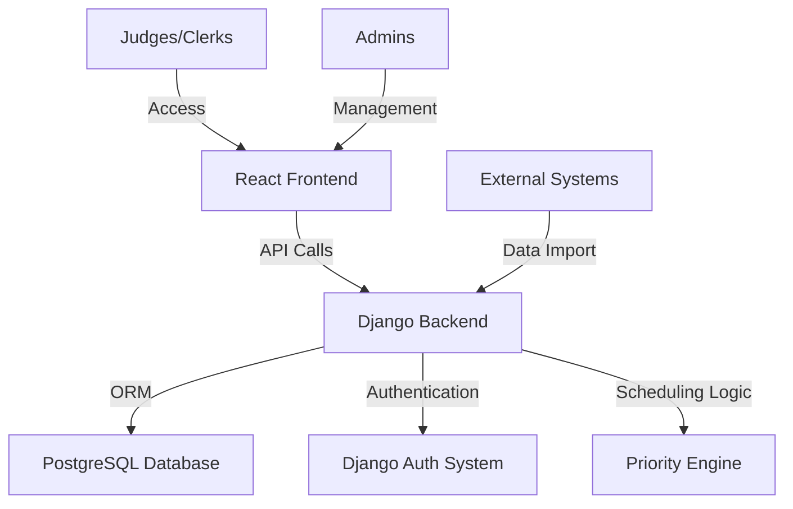

# Differentiated Case Flow Management (DCM) System Plan

## Overview
The DCM system aims to streamline case listing by prioritizing cases based on type, urgency, and resource demands rather than chronological order. This will reduce adjudication times and improve judicial efficiency.

## Technology Stack
- **Backend**: Java with Spring Boot
- **Frontend**: React.js
- **Database**: MySQL
- **Deployment**: Docker for containerization

## System Architecture

### Components:
- **Frontend**: User interface for case entry, listing, and management
- **Backend**: API server handling business logic, authentication, and data processing
- **Database**: Stores cases, users, priorities, and schedules
- **Priority Engine**: Algorithm to assign and manage case priorities
- **Authentication**: Role-based access for judges, clerks, and admins

## Key Features
- Case classification and priority assignment
- Intelligent scheduling bypassing FIFO order
- Timeline tracking and notifications
- Reporting and analytics
- User management with roles

## Implementation Plan
See the todo list for detailed steps.

## Next Steps
Review and approve this plan, then switch to Code mode for implementation.